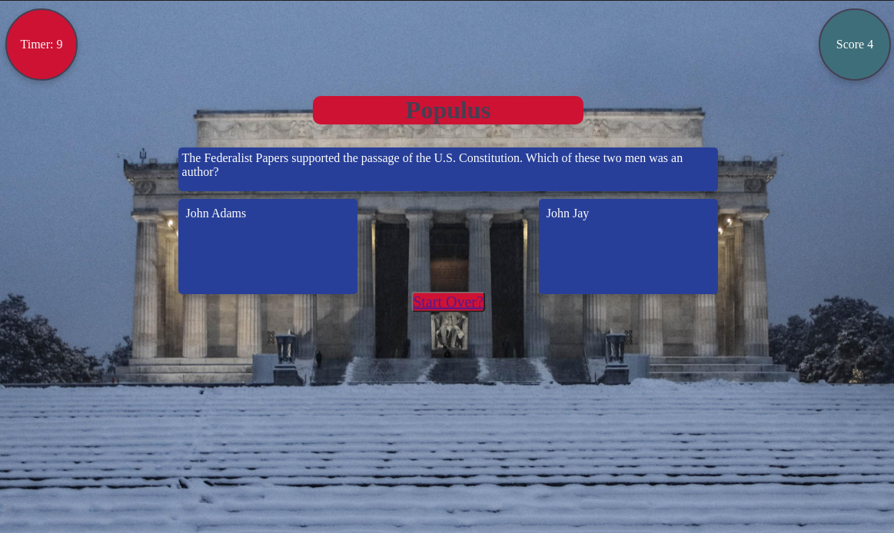

# Populus Trivia
Populus Trivia, at its core, is a basic trivia game. A set of questions are presented to the user, and as they click through, new questions are presented to them.

### Motivation
It's that time again! When every four years and in the fall when people become more invested in the workings of our government. I graduated from the University of Washington with a degree in political science, and through conversations with friends and family sometimes what they thought about how our government worked did not match up with the realities.

There's a Plato quote that I have carried around with me from *The Republic*, (Book 1, 346-374) where Plato writes: *...that is why the good are not willing to rule either for the sake of money or of honor... But the chief penalty is to be governed by someone worse if a man will not himself hold office and rule.* In short: those who do not participate in government consent to being governored by people worse than them.

The meaning of the saying to me has many implications, but the core of it I have always taken as: if we do not participate others will participate for us. Thus, we begin the trivia simply with questions drawn from the US Immigration Citizenship test and from my own memory dating back to when a curiosity was sparked about how the systems that dictate our day to day social life work.

---
### Screenshots

---
### User Stories & Wireframes
The planning materials used to build this app.
* A game to test your knowledge on the foundations and workings of our government.

* You will be asked about history, elections, and constitutional questions.

---
### Technologies & Code Snippets
* HTML, CSS, and JavaScript
* 

---
### Credits
Big shoutouts to my instructors James Sinkler for helping me get rid of array iteration and Michael Petty for helping me with my event listeners. To the TAs Steven and David: thank you for the help on my timer function. The grid layout is courtesy of [sarah_edo](https://cssgrid-generator.netlify.app/).

---

### Future development
I definitely want to expand the game to have multiple categories, with more questions presented to the user. Ideally the categories would be split into history inspired by Howard Zinn, more precise workings of the US government, and then hopefully some even fun ones about pop culture because as Jack Nicholson taught us "All work and no play makes Jack a dull boy."