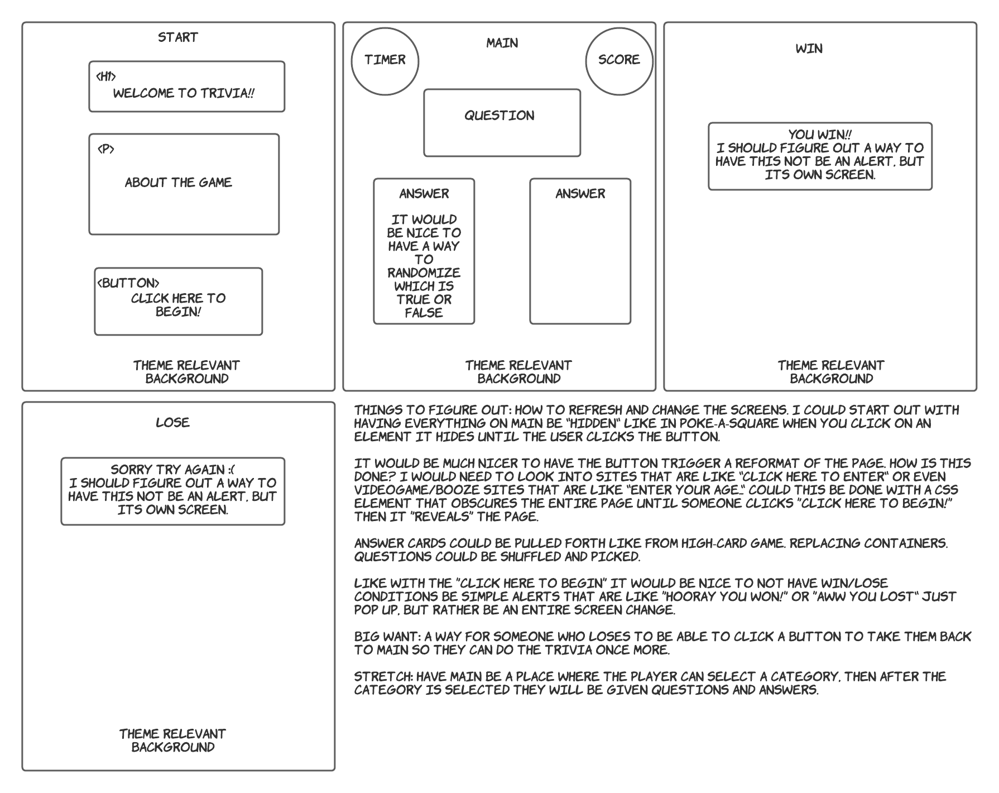

# Populus Trivia
A blurb about your project; what is it?

### Motivation
A short description about why you built this app.

---
### Screenshots
screen captures of your app

---
### User Stories & Wireframes
The planning materials used to build this app.
* High-level user stories.
* image files of wireframes

---
### Technologies & Code Snippets
* HTML, CSS, and JavaScript
* 

---
### Credits
Big shoutouts to my instructors James Sinkler for helping me get rid of array iteration, Michael Petty for helping me with my event listeners, my TAs Steven and David for my timer function!

---

### Future development
What are the next steps for the project? How will you continue to evolve it?